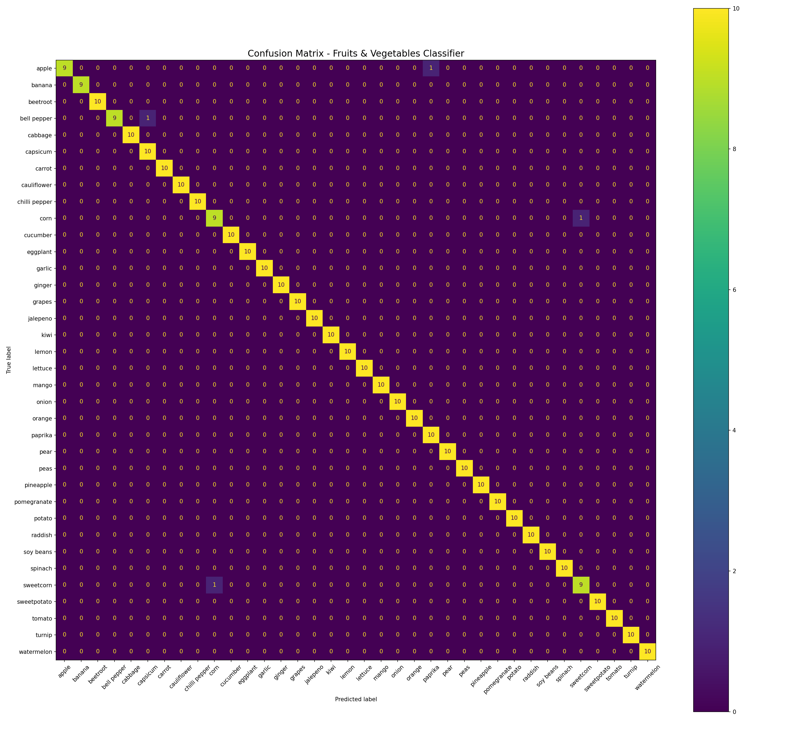
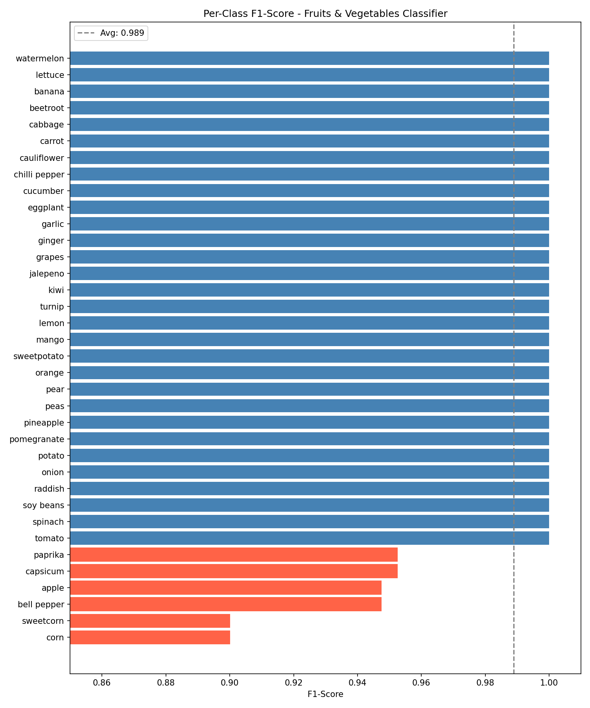

# 🥦 Fruits & Vegetables Image Classifier

Image classification project using a pre-trained Vision Transformer (ViT) model from HuggingFace.  
The model classifies **36 different fruits and vegetables** with high accuracy.

---

## 📌 Model

- **Model:** [flatmoon102/fruits_and_vegetables_image_classification](https://huggingface.co/flatmoon102/fruits_and_vegetables_image_classification)
- **Architecture:** Vision Transformer (ViT) fine-tuned on fruit & vegetable images
- **Classes:** 36 (apple, banana, carrot, corn, ...)

---

## 📊 Evaluation Results

Evaluated on the [Kaggle Fruits & Vegetables dataset](https://www.kaggle.com/datasets/kritikseth/fruit-and-vegetable-image-recognition) test set (359 images).

| Metric | Score |
|---|---|
| Accuracy | 98.89% |
| Macro F1 | 0.989 |
| Macro Precision | 0.99 |
| Macro Recall | 0.99 |

### Confusion Matrix


### Per-Class F1-Score


> Lowest performing classes are **corn / sweetcorn** and **bell pepper / capsicum** —  
> visually very similar categories, even for humans.

---

## 🚀 Usage

### Install dependencies
pip install transformers torch pillow

### Run prediction
```python
from transformers import pipeline
from PIL import Image

classifier = pipeline(
    "image-classification",
    model="flatmoon102/fruits_and_vegetables_image_classification"
)

image = Image.open("your_image.jpg")
results = classifier(image, top_k=3)

for r in results:
    print(f"{r['label']}: {r['score']:.2%}")
```

## 📁 Project Structure
├── predict.py           # Single image prediction
├── evaluate.py          # Full test set evaluation
├── confusion_matrix.png # Evaluation results
├── f1_scores.png        # Per-class F1 scores
├── requirements.txt
└── README.md


## 🛠️ Tech Stack

- Python 3.10
- HuggingFace Transformers
- PyTorch
- scikit-learn
- matplotlib
---

## 📁 Project Structure
